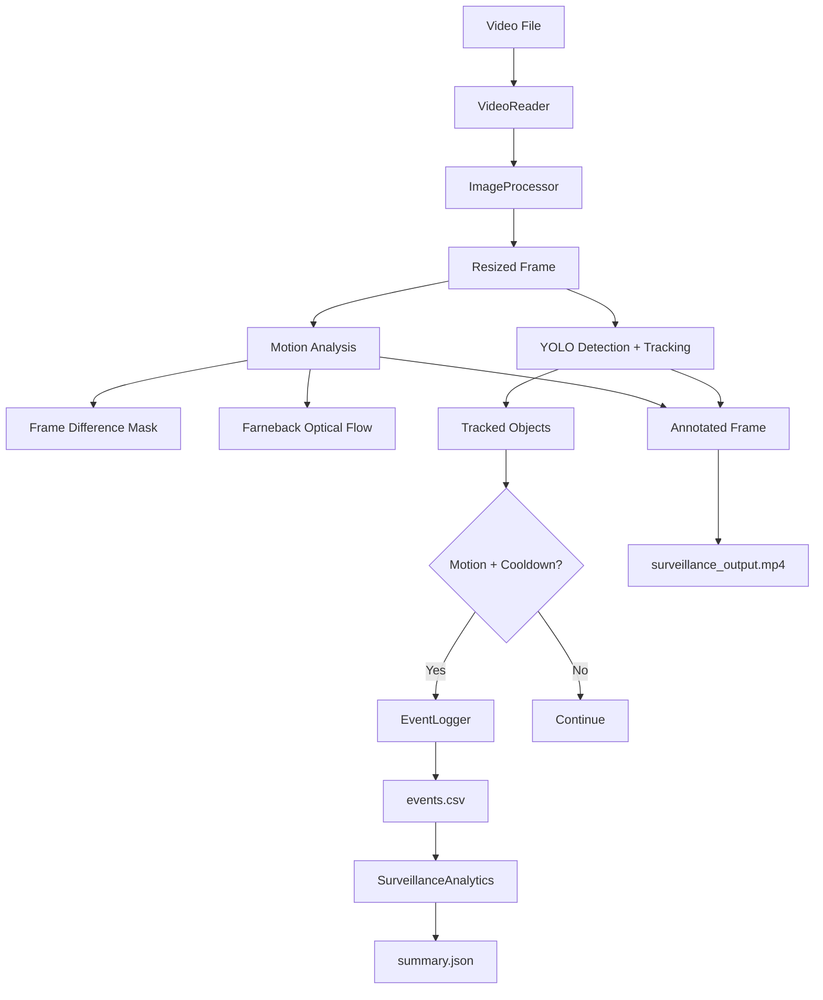
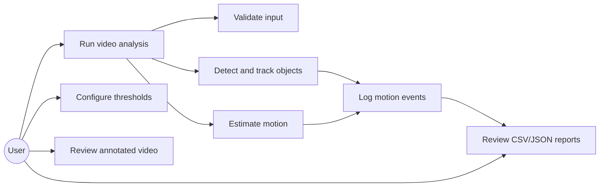
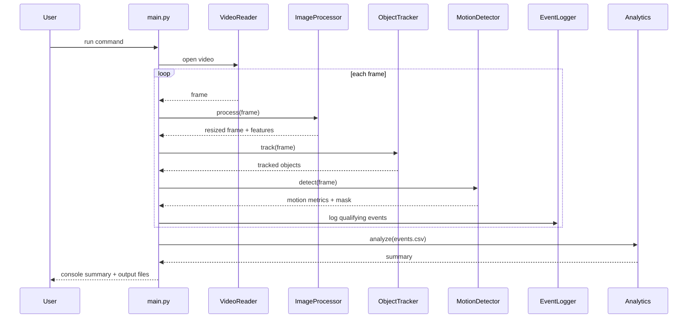
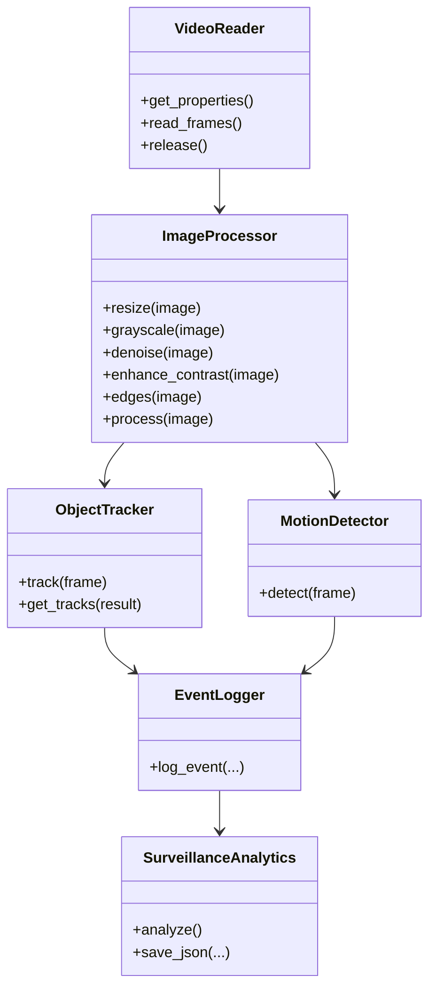

# System Design — Smart Surveillance and Motion Analysis

## 1. Architecture

The project uses a modular sequential pipeline. The main program only orchestrates modules; image preprocessing, motion estimation, tracking, logging and analytics have separate responsibilities.

## 2. Functional Modules

### Module 1 — Input and Preprocessing
`input/video_reader.py`, `preprocessing/image_processor.py`

Validates the video, reads frames, resizes them while preserving aspect ratio, applies Gaussian smoothing, CLAHE contrast enhancement and Canny edge extraction.

### Module 2 — Detection and Tracking
`detection/object_detector.py`, `tracking/object_tracker.py`

The project uses a pretrained YOLO model. Tracking is persistent across frames so detections can be associated with track IDs.

### Module 3 — Motion Analysis
`motion/motion_detector.py`

Two complementary measurements are calculated: thresholded frame difference gives a changed-pixel mask, while Farneback dense optical flow provides a mean motion magnitude.

### Module 4 — Event Logging and Analytics
`logging_module/event_logger.py`, `analytics/analytics.py`

When motion is detected, a cooldown prevents the same track from being written on every consecutive frame. Events are stored in CSV and summarized into JSON.

## 3. Workflow

1. Parse command-line arguments.
2. Validate and open the input video.
3. Read one frame.
4. Resize and preprocess the frame.
5. Run YOLO tracking.
6. Estimate motion from the current and previous frames.
7. Draw boxes, IDs and motion metrics.
8. Log qualifying motion events subject to cooldown.
9. Save the annotated frame to the output video.
10. After processing, calculate analytics and write `summary.json`.

## 4. Use Case Diagram

## 5. Sequence Diagram

## 6. Component / Class Diagram

## 7. Storage Design

No relational database is required for this batch application. The event store is a CSV file with the following schema:

| Field | Meaning |
|---|---|
| timestamp | Event creation time |
| frame_number | Frame where the event was recorded |
| event_type | Currently `Motion Detected` |
| object_id | Persistent tracker ID |
| object_class | YOLO class name |
| confidence | Detection/tracking confidence |
| motion_pixels | Number of changed pixels in motion mask |
| mean_flow | Mean optical-flow magnitude |

`summary.json` stores run-level metrics such as frames processed, elapsed time, event count, unique IDs, class counts and average motion/confidence values.

## 8. Design Decisions and Rationale

- **Command line instead of GUI:** satisfies terminal-based execution and makes batch processing reproducible.
- **YOLO tracking:** provides object classes, confidence values and persistent IDs without implementing a tracker from scratch.
- **Two motion measurements:** frame differencing is simple and interpretable; optical flow adds motion magnitude information.
- **Cooldown logging:** limits duplicate records while preserving repeated events over time.
- **CSV + JSON:** lightweight, portable and sufficient for a single-run project; a database is unnecessary for the current scope.
- **Lazy YOLO import:** deterministic preprocessing tests can run even before the heavy model dependency is installed.

## 9. Non-Functional Requirements

| Requirement | Implementation |
|---|---|
| Performance | Configurable frame width, optional frame limit and optional video writing. |
| Reliability | Invalid paths and unreadable videos raise clear exceptions; resources are released with `finally`. |
| Maintainability | Separate modules and centralized defaults; CLI flags override defaults. |
| Usability | `python main.py --help` exposes all runtime options. |
| Resource efficiency | Frames are resized before model/motion processing. |
| Testability | Preprocessing, motion, logging and analytics have automated tests. |
| Observability | Console summary and structured CSV/JSON outputs provide run-level evidence. |

## 10. Rendered Design Artifacts

PNG versions are included under `docs/` for reviewers who do not render Mermaid diagrams:

- `docs/architecture.png`
- `docs/usecase.png`
- `docs/sequence.png`
- `docs/component.png`
